

# **	
# `		`**Home Page**
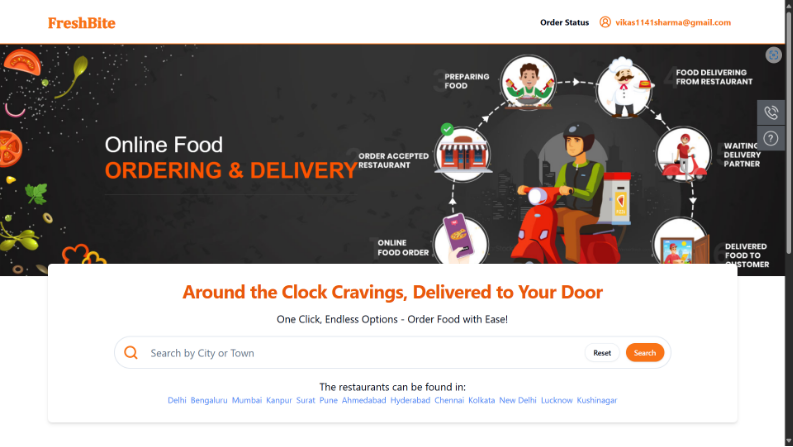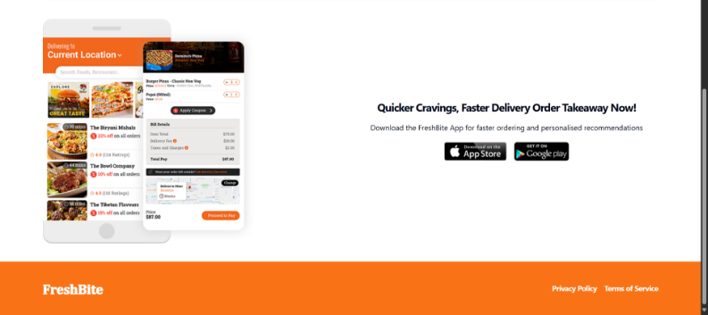

# **		Login Page
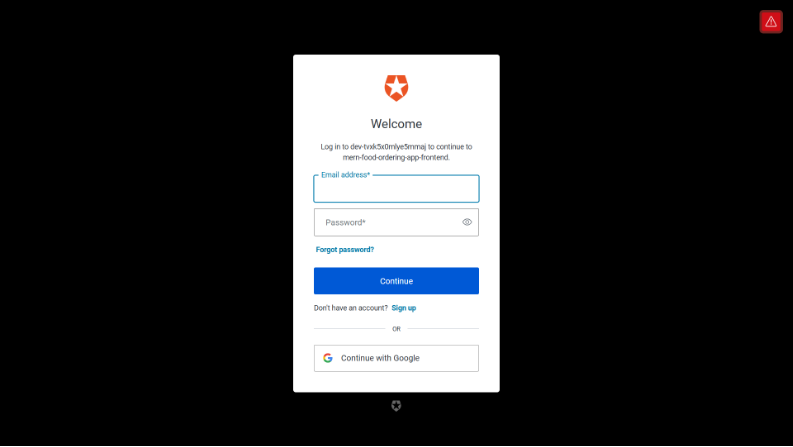

# `		`**Manage Restaurant Page**
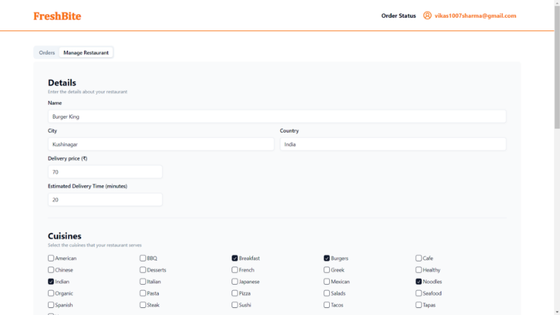

# **Search Restaurant**
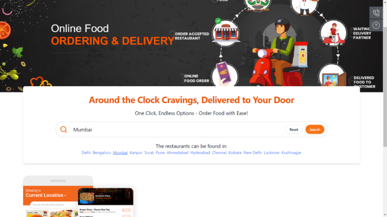

# **		
#
# **Search Page**
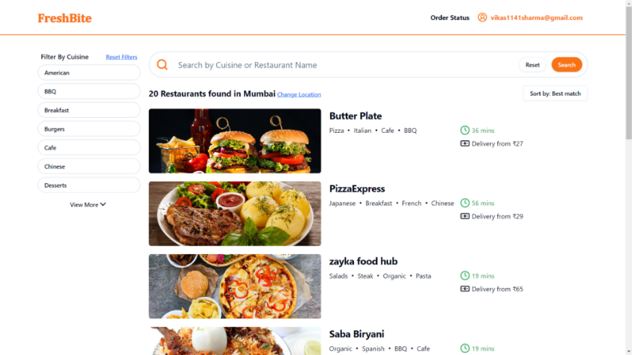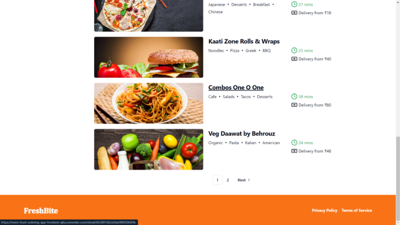

# **		
# **Filter by Cuisine**
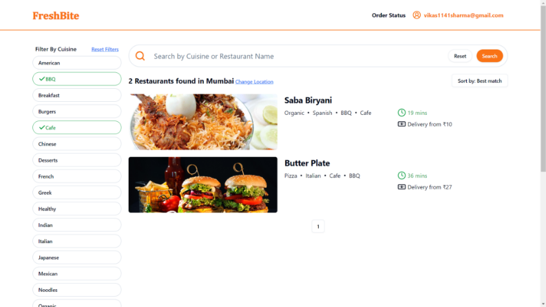

`		`**Search by cuisine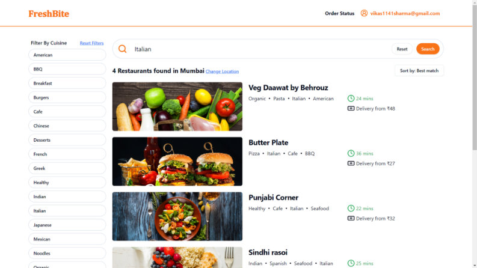**

# `		`**Restaurant Page**
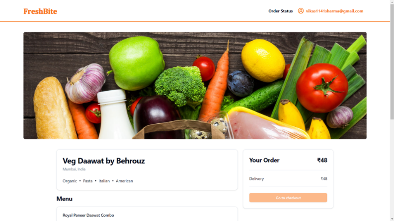

#
#
# **Checkout Page**
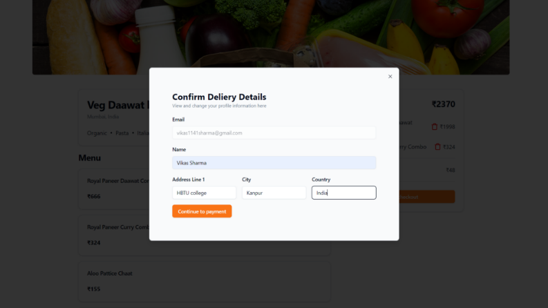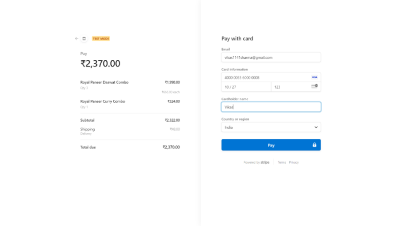

`		`

# **Order Details**
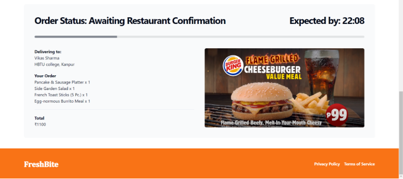

# `		`**Restaurant Owner can change order details** 
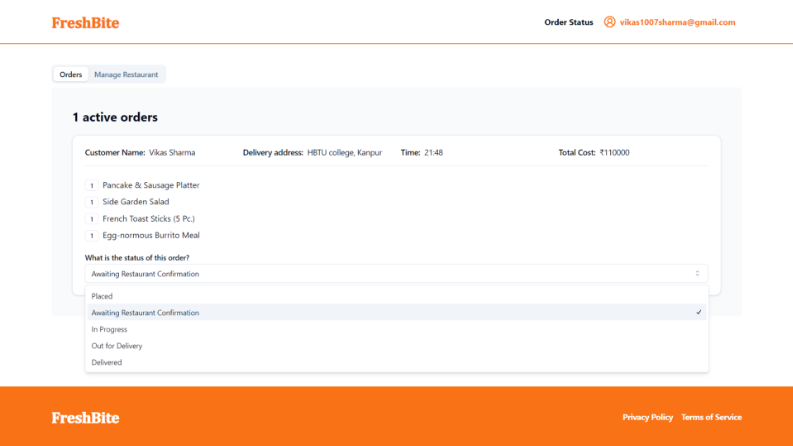
