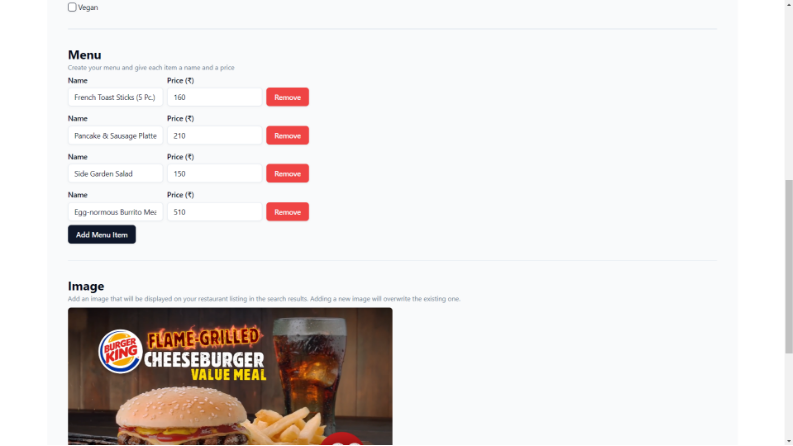
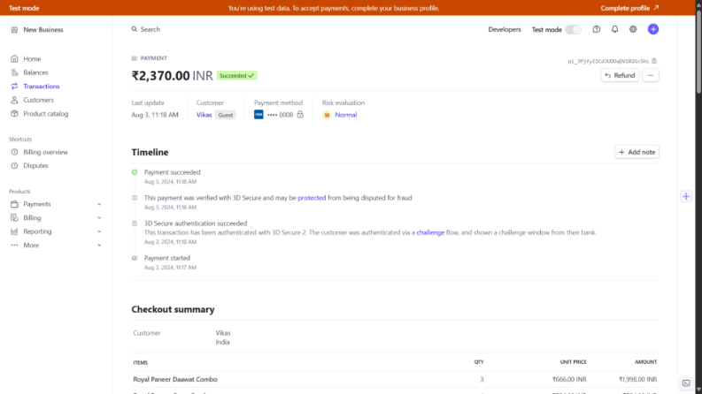

# **	
# `		`**Home Page**

# **		Login Page

# `		`**Manage Restaurant Page**

# **Search Restaurant**

# **		
#
# **Search Page**

# **		
# **Filter by Cuisine**

`		`**Search by cuisine**

# `		`**Restaurant Page**

#
#
# **Checkout Page**

`		`

# **Order Details**

# `		`**Restaurant Owner can change order details** 

